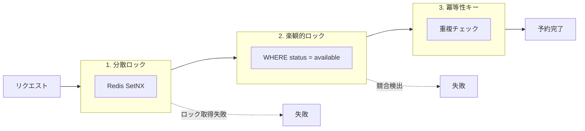
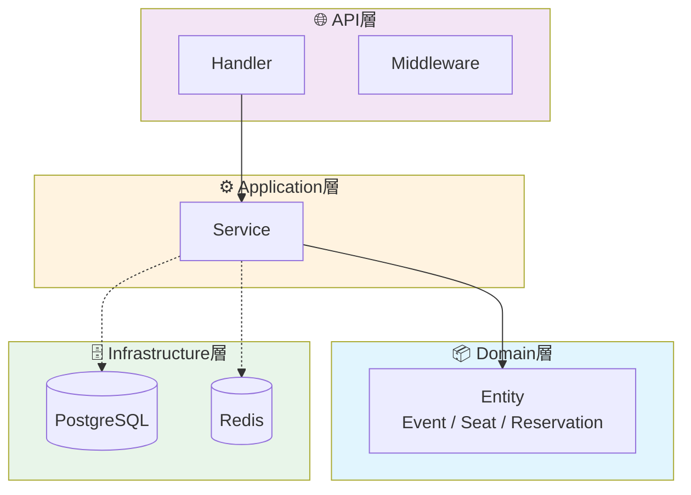
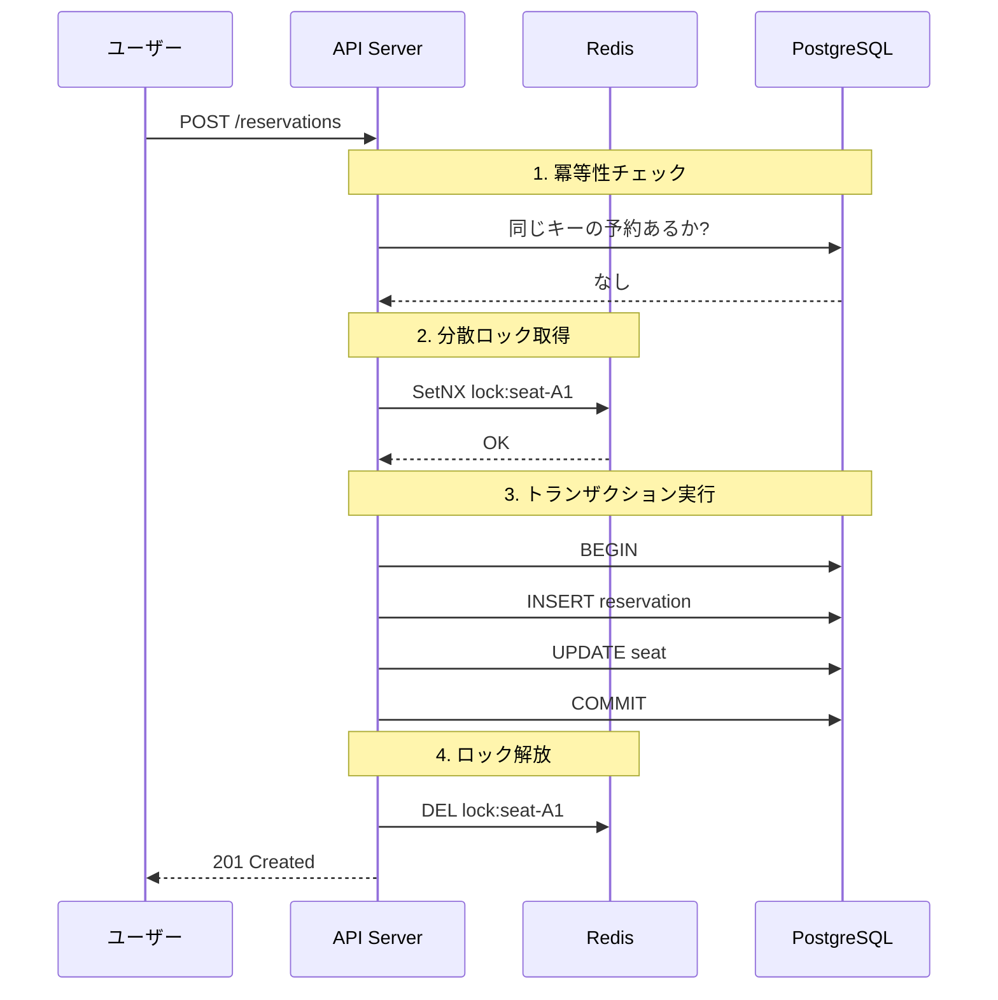
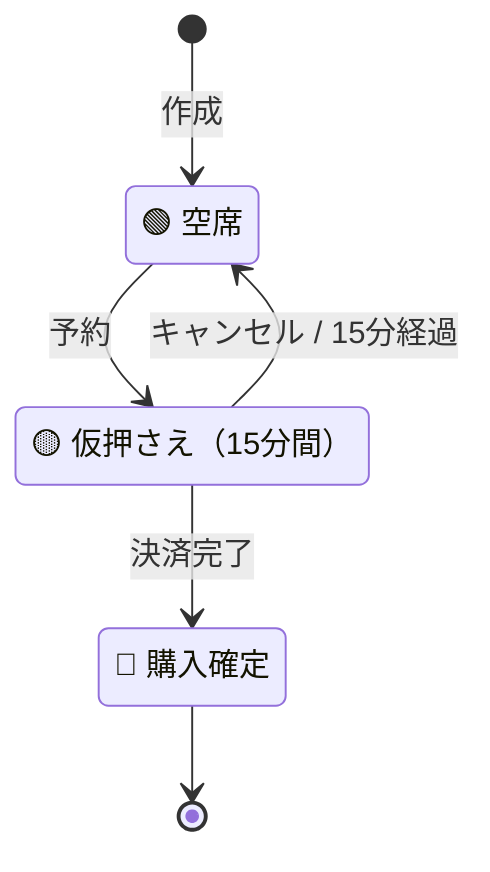

# 大規模トラフィック・高並行処理において、データ整合性とスケーラビリティを両立するには

## はじめに

この記事では、個人開発で取り組んだイベントチケット予約システムについて、設計と実装を振り返ります。

このプロジェクトの動機は2つあります。1つ目は、実務で扱ってきた高並行処理・データ整合性の課題を、異なる技術スタックで再実装することで理解を深めたかったこと。2つ目は、実務で使用している.NET/C#とは異なる言語であるGoでの開発経験を積みたかったことです。

題材としてイベントチケット予約を選んだ理由は、「数千のリクエストが同時に単一リソースへ集中する」という高並行シナリオを自然に設定でき、二重予約防止という明確なゴールがあるためです。

## 同時リクエストによる二重予約のリスク

チケット販売開始直後は、数千のリクエストが同じ座席に殺到します。このとき、データ整合性を保ち、1つの座席が1人のユーザーにのみ販売されることを保証する必要があります。

技術的には「競合状態（`Race Condition`）」として知られる問題です。「①座席が空いているか確認（`SELECT`）」→「②空いていれば予約（`UPDATE`）」という処理を分離すると、ユーザーAとBが同時に①を通過し、両者とも②を実行してしまいます。

単一のロック機構だけでは、ネットワーク遅延、クライアントの再試行、サーバーのスケールアウトといった状況に対応しきれません。そこで、複数の独立した仕組みを組み合わせる必要があります。

## 3層の競合制御

このシステムでは、分散ロック、楽観的ロック、冪等性キーの3つを組み合わせました。それぞれが異なる障害パターンに対応します。分散ロックはサーバー間の競合を入口で捌き、楽観的ロックはデータベース更新時の最終チェックとして機能し、冪等性キーはクライアントの再試行やネットワーク起因の重複を処理します。



### 分散ロックによるリクエストの直列化

複数のAPIサーバーが並行して稼働する分散環境において、単一のリソース（特定の座席）へのアクセスを制御するためには、サーバーを横断した排他制御機構が不可欠です。ここでは、`Redis`を利用した分散ロックを導入し、特定座席への予約リクエストを直列化します。

具体的には、`Redis`の`SetNX`（SET if Not eXists）コマンドを使用します。このコマンドは、指定したキーが存在しない場合にのみ値を設定し、成功したことを示す応答を返します。ある座席に対する最初の予約リクエストが`SetNX`を実行するとロックが取得され、後続の全てのリクエストはキーが既に存在するためロック取得に失敗します。これにより、最初に到達したリクエストのみが次の処理へ進み、他のリクエストは即座に失敗として処理されます。

```go
// SetNX = "Set if Not eXists"
ok, _ := client.SetNX(ctx, "lock:seat-A1", ownerID, 10*time.Second)
if !ok {
    return ErrLockNotAcquired // 他のサーバー/ユーザーがロック中
}
```

### 楽観的ロックによるデータ整合性の保証

分散ロックを通過したリクエストは理論上1つだけです。しかし、ロックのTTL切れや`Redis`障害などで複数リクエストが通過する可能性はゼロではありません。そこで、データベース更新時にも楽観的ロックで整合性をチェックします。

楽観的ロックは、更新対象のレコードが「期待通りの状態であること」を`UPDATE`文の`WHERE`句で検証するパターンです。座席を予約済みに更新する際、`WHERE`句に`status = 'available'`という条件を加えます。これにより、更新対象の座席が現在も「利用可能」な状態である場合にのみ、更新が成功します。もし分散ロックを何らかの理由で通過した別のリクエストが先に更新を完了させていた場合、後から来たリクエストの`UPDATE`文は条件に合致せず、更新対象件数は0件となります。この結果を検知することで、競合が発生したと判断し、トランザクションをロールバックできます。

```sql
UPDATE seats SET status = 'reserved', version = version + 1
WHERE id = 'seat-A1' AND status = 'available';
-- 更新件数が0なら競合発生
```

### 冪等性による重複処理の防止

冪等性とは、同じ操作を何度実行しても結果が変わらない性質です。ネットワークの不安定さやクライアント側の実装により、ユーザーが予約ボタンをダブルクリックしたり、タイムアウト後にリクエストが再試行されたりすることがあります。このとき、処理が冪等でなければ、同じ予約が重複して作成される可能性があります。

このシステムでは、冪等性キーを使って処理を冪等にしています。クライアントは各リクエストにユニークなキーを付与し、サーバーはそのキーで既存の予約を検索します。既に同じキーの予約が存在すれば、新規作成せずに既存の結果を返します。これにより、リクエストが何度実行されても、システムの状態は初回成功時から変わりません。

```go
existing, err := repo.GetByIdempotencyKey(ctx, key)
if err == nil {
    return existing, nil // 既存の予約を返す（新規作成しない）
}
```

## システムアーキテクチャと技術スタック

このシステムでは、保守性、拡張性、テストのしやすさを重視し、クリーンアーキテクチャを採用しました。ビジネスロジックとインフラストラクチャを分離することで、ビジネスルールの変更がデータベース層に影響せず、逆にデータベースの変更もビジネスロジックに影響しません。

### アーキテクチャ設計

クリーンアーキテクチャは、システムを同心円状のレイヤーに分割します。本システムでは、以下の4つの主要なレイヤーで構成されています。



* `Domain`層: システムの最も内側に位置し、イベント、座席、予約といったビジネスエンティティと、それらに関する純粋なビジネスルールを定義します。この層は他のどの層にも依存しません。
* `Application`層: ユースケース層とも呼ばれ、`Domain`層のエンティティを利用して具体的なアプリケーションのサービス（例：「座席を予約する」）を実装します。
* `API`層: 最も外側の層の一つで、HTTPリクエストの受付とレスポンスの返却を担当するハンドラーやミドルウェアが含まれます。この層は`Application`層のサービスを呼び出します。
* `Infrastructure`層: データベース（`PostgreSQL`）やキャッシュ/ロック機構（`Redis`）など、外部の技術的な詳細を実装します。この層は内側の層で定義されたインターフェースを実装する形で連携します。

この設計の重要な原則は、「依存関係の方向が常に外側から内側へ向かう」ことです。例えば、`Application`層は`Domain`層に依存しますが、`Domain`層は`Application`層について何も知りません。同様に、`PostgreSQL`や`Redis`といった具体的な技術は`Infrastructure`層に閉じ込められており、ビジネスロジックはそれらの存在を直接意識することなく、抽象的なインターフェースを介して連携します。

### 技術スタック

このシステムを構成する主要な技術は以下の通りです。

| 役割 | 技術 |
|------|------|
| 言語 | Go 1.24 |
| Webフレームワーク | Echo v4 |
| データベース | PostgreSQL 16 |
| キャッシュ / ロック | Redis 7 |
| 監視 | Prometheus + 構造化ログ (zap) |
| CI/CD | GitHub Actions |
| APIドキュメント | OpenAPI / Swagger |

`Go`では、`interface`による暗黙的な実装とコンストラクタ注入で`DI`を実現しています。`C#`の`DI`コンテナとはアプローチが異なりますが、依存性逆転の原則は同様に適用できます。

## 予約処理フローの実装

ここでは、実際の予約フローを見ていきます。

### 処理ステップ

予約リクエストを受け取ると、以下の順序で処理が進みます。



1. 冪等性チェック: APIサーバーは、まずリクエストに含まれる冪等性キーを使い、`PostgreSQL`に同じキーを持つ予約が既に存在しないかを確認します。存在する場合は、新規作成せずに既存の予約情報を返却します。
2. 分散ロック取得: 冪等性チェックを通過後、APIサーバーは対象座席のロックキー（例: `lock:seat-A1`）を使い、`Redis`に対して`SetNX`コマンドを実行して分散ロックの取得を試みます。ロック取得に失敗した場合、リクエストはここで弾かれます。
3. トランザクション実行: ロック取得に成功すると、APIサーバーは`PostgreSQL`上でデータベーストランザクションを開始します。トランザクション内では、予約情報の`INSERT`と、座席ステータスを`available`から`reserved`へ更新する`UPDATE`が実行されます。この`UPDATE`文には楽観的ロックの`WHERE status = 'available'`句が含まれており、最終的な整合性が保証されます。
4. ロック解放: トランザクションが正常にコミットされた後、APIサーバーは`Redis`に`DEL`コマンドを送信し、取得していた分散ロックを解放します。これにより、他のユーザーが別の座席を予約できるようになります。

### 仮押さえ状態の設計

予約処理では、即座に確定するのではなく、15分間の「仮押さえ」状態を経由します。ユーザーに決済の猶予を与えつつ、在庫が無期限に確保されることを防ぐためです。



* `available`（空席）: 座席が予約可能な初期状態です。
* `reserved`（仮押さえ）: ユーザーが予約処理を完了させると、この状態に遷移します。期間内に確定処理が行われなかった座席は、自動的に`available`状態に戻ります。
* `confirmed`（確定）: ユーザーが決済を完了させると、この状態に遷移し、予約が確定します。

## 負荷テスト結果

設計が実際の高負荷シナリオで機能するかを確認するため、負荷テストを実施しました。

### ストレステスト（200並行ユーザー）

通常運用を想定した負荷テストです。読み取り80%・書き込み20%の比率で、200並行ユーザーが2分間リクエストを送り続けるシナリオを実行し、スループットとレスポンスタイムを計測しました。

| 指標 | 結果 |
|------|------|
| 最大並行ユーザー | 200 VU |
| スループット | 1,426 req/sec |
| p95 レスポンス | 40.23 ms |
| p99 レスポンス | 148.2 ms |
| エラー率 | 0.00% |
| 総リクエスト数 | 171,380 |

スループットは毎秒1,400リクエストを超え、ユーザーの95%が40ms以内に応答を受け取っており、エラー率も0%であることから、システムは高負荷下でも安定的かつ高速に稼働しています。

### 競合テスト（50ユーザーによる単一座席の予約）

50並行ユーザーが単一の座席を同時に予約するシナリオで、二重予約が発生しないことを検証しました。

* 予約成功: 1件
* 競合失敗: 49件
* 二重予約: 0件

50件の同時リクエストに対して1件のみが成功し、残りの49件は競合として正常に失敗処理されました。二重予約は発生していません。

### 水平スケーリングテスト（3台構成）

ロードバランサー配下に3台のAPIサーバーを配置し、100ユーザーが同時に単一座席の予約を行いました。

* テスト対象: 100並行ユーザー
* サーバー構成: ロードバランサー配下に3台のAPIサーバー
* 予約成功: 1件
* 競合失敗: 99件
* 二重予約: 0件

分散環境でも二重予約ゼロを維持できることが確認できました。ステートフルな競合管理（`Redis`）がステートレスなアプリケーションサーバーから分離されているため、サーバーを追加するだけで水平スケーリングが可能です。

### 大規模データベンチマーク（10万座席）

スタジアム規模のイベントを想定し、10万席のデータでパフォーマンスを検証しました。

| 操作 | 結果 |
|------|------|
| 座席一括作成 | 3.1秒（32,153 席/秒） |
| 空席カウント | 18.8 ms |
| 1000人同時予約（異なる座席） | 100% 成功 |
| 100人競合予約（単一座席） | 1人成功、99人失敗（二重予約0件） |

データ量が10万件に増えても、処理速度と二重予約ゼロの両方を維持できています。

## おわりに

この個人開発を通じて、実務で扱ってきた高並行処理の知識をGoで再実装し、言語への理解を深めることができました。

分散ロック、楽観的ロック、冪等性キーという3つの仕組みを組み合わせることで、リクエストの競合や重複を複数の段階でフィルタリングし、高負荷下でもデータ整合性を保証できました。単一の技術に頼らず、それぞれの強みを活かすことで、システム全体の信頼性を高めています。

C#で培った並行処理の知識を、`goroutine`や`interface`といったGoの機能で再実装する過程で、言語固有の特性と設計原則の両方を意識できました。

今回の実装を通じて、並行処理制御やトランザクション設計についてはまだ学ぶべきことが多いと感じています。引き続き、こうした設計パターンへの理解を深めていきたいと思います。

本記事で紹介したシステムのソースコードは GitHub で公開しています：

- [**リポジトリ**](https://github.com/sano-suguru/go-event-ticket-reservation) - ソースコード全体
- [**README.md**](https://github.com/sano-suguru/go-event-ticket-reservation/blob/main/README.md) - クイックスタート、API概要、負荷テスト結果
- [**IMPLEMENTATION.md**](https://github.com/sano-suguru/go-event-ticket-reservation/blob/main/docs/IMPLEMENTATION.md) - テスト戦略、Prometheusメトリクス、CI/CD詳細
