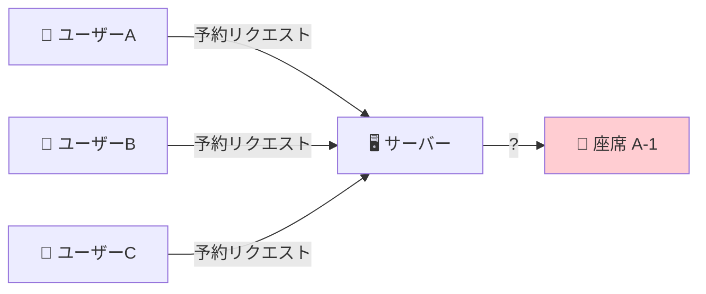
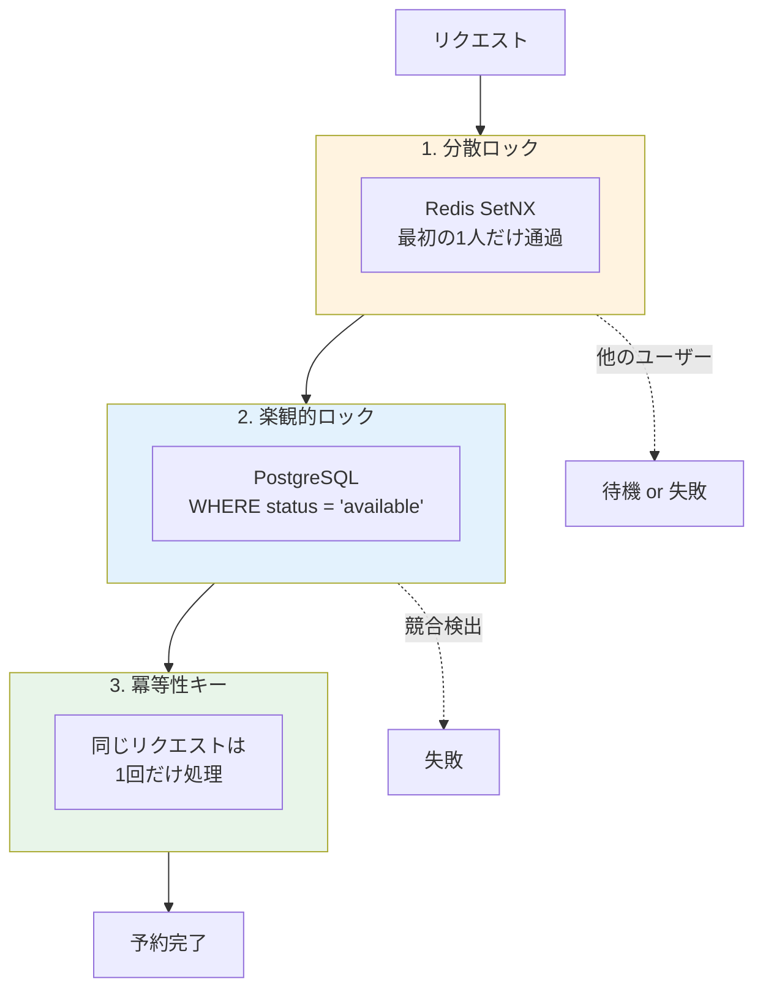
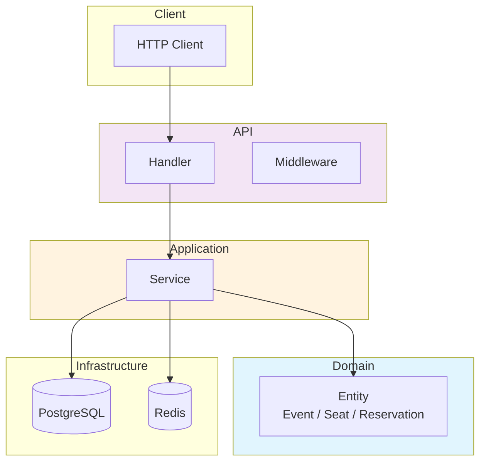
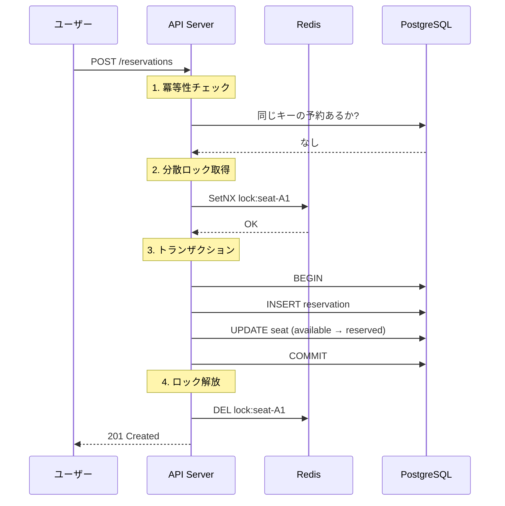
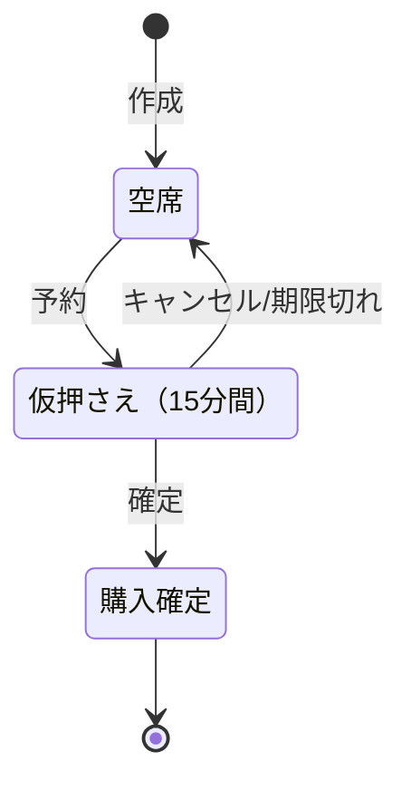

# Event Ticket Reservation System

高並行性イベントチケット予約システムのバックエンド API

**「同じ座席を2人に販売しない」** を確実に実現します。

---

## 解決する課題

人気コンサートの発売開始時、数千人が同時に同じ座席を狙います。



この状況で**1つの座席は必ず1人だけ**に販売しなければなりません。

---

## 解決策：3層の防御



| 層 | 役割 | 仕組み |
|----|------|--------|
| **分散ロック** | 同時アクセスを直列化 | Redis の SetNX で1人だけ通過 |
| **楽観的ロック** | データ整合性を保証 | `WHERE status = 'available'` で更新 |
| **冪等性キー** | 重複リクエストを防止 | 同じキーは既存結果を返す |

---

## 技術スタック

| 役割 | 技術 |
|------|------|
| 言語 | Go 1.23 |
| Web | Echo v4 |
| DB | PostgreSQL 16 |
| キャッシュ / ロック | Redis 7 |
| 監視 | Prometheus + 構造化ログ (zap) |
| CI/CD | GitHub Actions |
| API ドキュメント | OpenAPI / Swagger |

---

## アーキテクチャ



**Clean Architecture** を採用。依存関係は外側から内側への一方向のみ。

---

## 予約フロー



---

## 座席の状態遷移



**15分間**の仮押さえ後、自動でキャンセルされ座席が解放されます。

---

## 負荷テスト結果

50人が同時に同じ座席を予約するテスト:

```
予約成功:   1 件（1人だけが座席を確保）
競合失敗:  49 件（正常に弾かれた）
二重予約:   0 件
```

| 指標 | 結果 |
|------|------|
| スループット | 24.6 req/sec |
| p95 レスポンス | 10.77 ms |
| エラー率 | 1.34%（競合による正常な失敗） |

---

## クイックスタート

```bash
# 1. 依存サービス起動
docker compose up -d

# 2. マイグレーション
make migrate-up

# 3. アプリケーション起動
make run

# 4. Swagger UI
open http://localhost:8080/swagger/index.html
```

---

## API 概要

| 操作 | メソッド | パス |
|------|----------|------|
| イベント作成 | POST | `/api/v1/events` |
| 座席一括作成 | POST | `/api/v1/events/:id/seats/bulk` |
| 予約作成 | POST | `/api/v1/reservations` |
| 予約確定 | POST | `/api/v1/reservations/:id/confirm` |
| 予約キャンセル | POST | `/api/v1/reservations/:id/cancel` |

詳細は [Swagger UI](http://localhost:8080/swagger/index.html) を参照。

---

## プロジェクト構成

```
├── cmd/api/          # エントリーポイント
├── internal/
│   ├── domain/       # ビジネスルール（純粋Go）
│   ├── application/  # ユースケース
│   ├── infrastructure/
│   │   ├── postgres/ # DB操作
│   │   └── redis/    # 分散ロック、キャッシュ
│   ├── api/          # HTTPハンドラー
│   └── worker/       # バックグラウンド処理
└── db/migrations/    # SQLマイグレーション
```

---

## 技術的なポイント

### 分散ロック（Redis）

```go
// SetNX = "Set if Not eXists"
ok, _ := client.SetNX(ctx, "lock:seat-A1", ownerID, 10*time.Second)
if !ok {
    return ErrLockNotAcquired  // 他の誰かがロック中
}
```

### 楽観的ロック（PostgreSQL）

```sql
UPDATE seats 
SET status = 'reserved', version = version + 1
WHERE id = 'seat-A1' AND status = 'available';
-- 更新件数が0なら競合発生
```

### 冪等性キー

```go
existing, err := repo.GetByIdempotencyKey(ctx, key)
if err == nil {
    return existing, nil  // 既存の予約を返す（新規作成しない）
}
```

---

## 詳細ドキュメント

- [技術解説 (IMPLEMENTATION.md)](docs/IMPLEMENTATION.md) - 設計思想と実装詳細

---

## License

MIT
