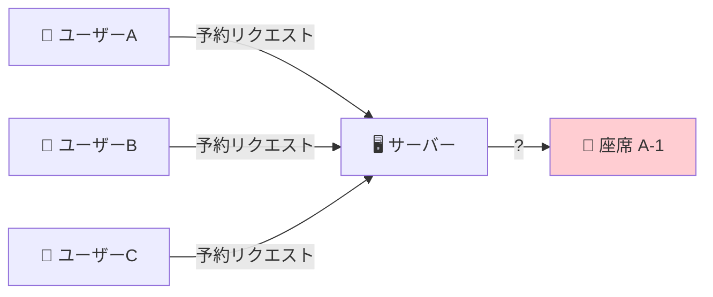
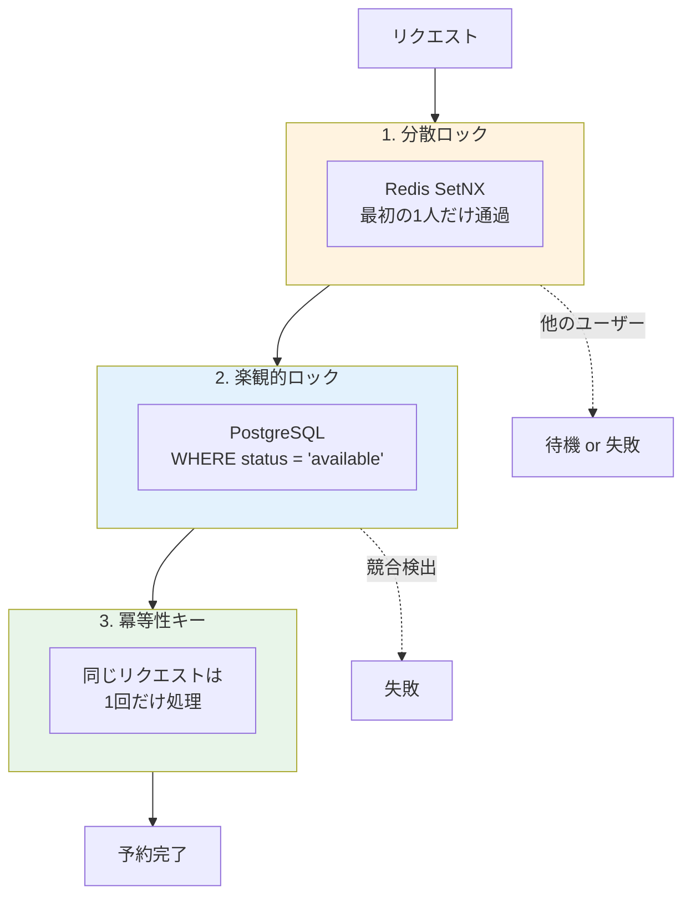
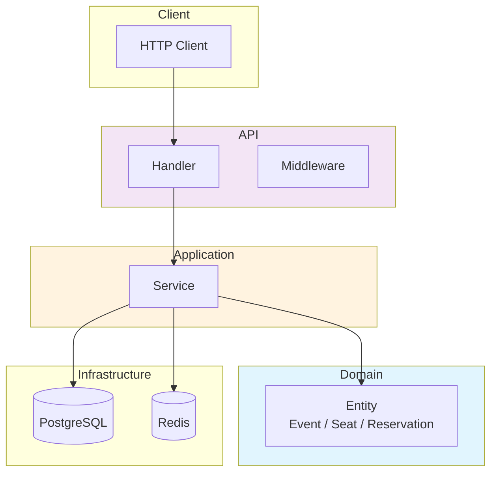
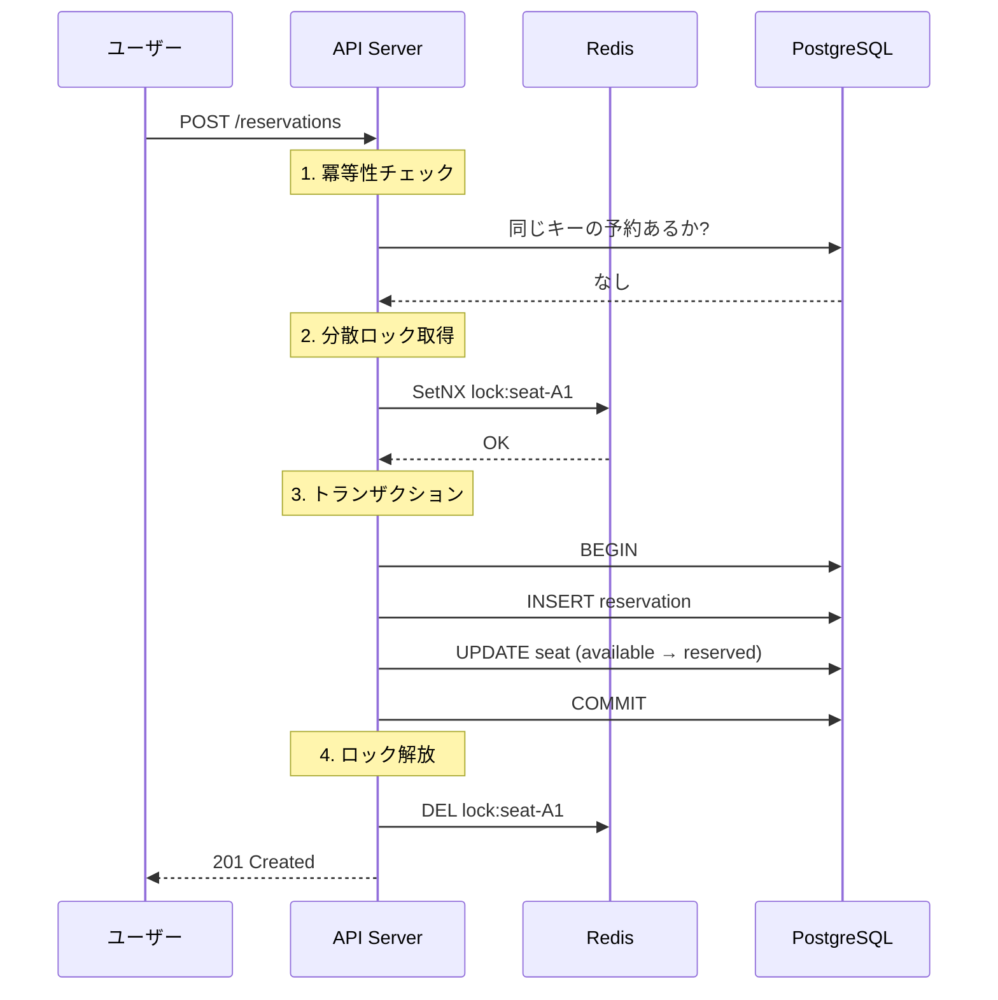
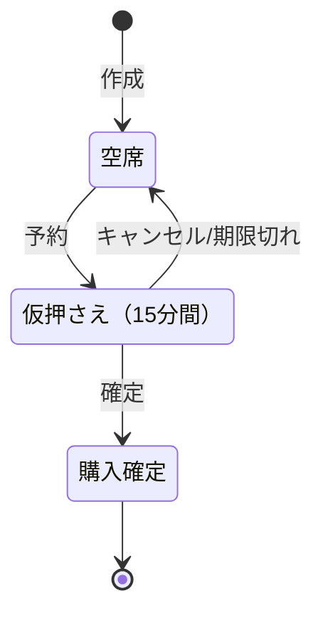
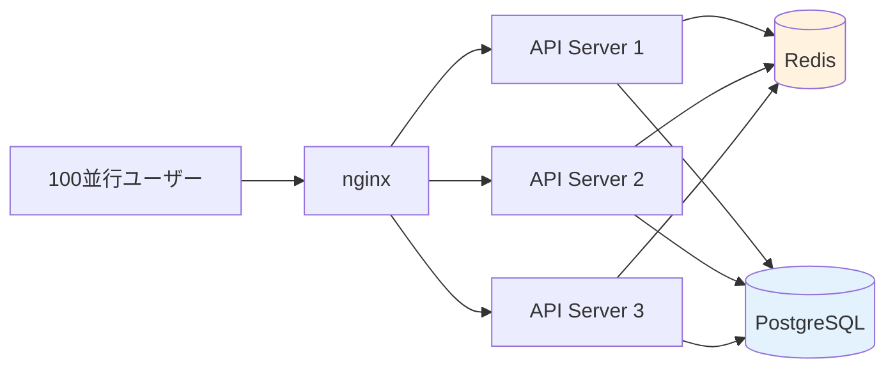

# Event Ticket Reservation System

[](https://github.com/sano-suguru/go-event-ticket-reservation/actions/workflows/ci.yml)
[](https://go.dev/)
[](LICENSE)
[](https://go-event-ticket-reservation-production.up.railway.app/swagger/index.html)

大規模トラフィック（高負荷 / 高並行）・大量データでも二重予約ゼロを保証するイベントチケット予約システム

---

## 解決する課題

人気コンサートの発売開始時、数千人が同時に同じ座席を狙います。



この状況で**1つの座席は必ず1人だけ**に販売しなければなりません。

---

## 解決策：3層の防御



| 層 | 役割 | 仕組み |
|----|------|--------|
| **分散ロック** | 複数サーバー間で同時アクセスを直列化 | Redis の SetNX で1人だけ通過 |
| **楽観的ロック** | データ整合性を保証 | `WHERE status = 'available'` で更新 |
| **冪等性キー** | 重複リクエストを防止 | 同じキーは既存結果を返す |

---

## 技術スタック

| 役割 | 技術 |
|------|------|
| 言語 | Go 1.24 |
| Web | Echo v4 |
| DB | PostgreSQL 16 |
| キャッシュ / ロック | Redis 7 |
| 監視 | Prometheus + 構造化ログ (zap) |
| CI/CD | GitHub Actions |
| API ドキュメント | OpenAPI / Swagger |

---

## アーキテクチャ



**Clean Architecture** を採用。依存関係は外側から内側への一方向のみ。

---

## 予約フロー



---

## 座席の状態遷移



**15分間**の仮押さえ後、自動でキャンセルされ座席が解放されます。

---

## 負荷テスト結果

### ストレステスト（200 並行ユーザー）

混合ワークロード（読み取り80%、書き込み20%）で2分間実行:

| 指標 | 結果 |
|------|------|
| **最大並行ユーザー** | 200 VU |
| **スループット** | 1,426 req/sec |
| **p95 レスポンス** | 40.23 ms |
| **p99 レスポンス** | 148.2 ms |
| **エラー率** | 0.00% |
| **総リクエスト数** | 171,380 |

### 競合テスト（50人が同じ座席を予約）

```
予約成功:   1 件（1人だけが座席を確保）
競合失敗:  49 件（正常に弾かれた）
二重予約:   0 件
```

高負荷時も二重予約ゼロ。

### 水平スケーリングテスト（3台構成）

nginx + 3台の API サーバーで100人同時予約:



```
予約成功:   1 件（3台に分散しても1人だけ成功）
競合失敗:  99 件
二重予約:   0 件
```

複数サーバー間でも Redis 分散ロックが正しく機能。

### 大規模データベンチマーク（10万座席）

スタジアム規模のイベント（10万座席）でのパフォーマンス:

| 操作 | 結果 |
|------|------|
| **座席一括作成** | 3.1秒（32,153 席/秒） |
| **空席カウント** | 18.8ms |
| **1000人同時予約** | 100% 成功（異なる座席） |
| **100人競合予約** | 1人成功、99人失敗（二重予約0件） |

大規模データでもデータ整合性を維持。

---

## 🌐 デモ環境

本番デプロイ済みの API にアクセスできます：

| リソース | URL |
|----------|-----|
| **Swagger UI** | https://go-event-ticket-reservation-production.up.railway.app/swagger/index.html |
| ヘルスチェック | https://go-event-ticket-reservation-production.up.railway.app/health |
| Prometheus メトリクス | https://go-event-ticket-reservation-production.up.railway.app/metrics |

> **Note**: Railway の無料プランではアイドル時にスリープするため、初回アクセス時に数秒かかる場合があります。

> **Note**: `/metrics` エンドポイントは意図的に認証なしで公開しています。Prometheus メトリクスには機密情報は含まれておらず、システムの透明性を優先しています。

---

## クイックスタート

```bash
# 1. 依存サービス起動
docker compose up -d

# 2. マイグレーション
make migrate-up

# 3. アプリケーション起動
make run

# 4. Swagger UI
open http://localhost:8080/swagger/index.html
# または本番環境: https://go-event-ticket-reservation-production.up.railway.app/swagger/index.html
```

---

## API 概要

| 操作 | メソッド | パス |
|------|----------|------|
| イベント作成 | POST | `/api/v1/events` |
| 座席一括作成 | POST | `/api/v1/events/:id/seats/bulk` |
| 予約作成 | POST | `/api/v1/reservations` |
| 予約確定 | POST | `/api/v1/reservations/:id/confirm` |
| 予約キャンセル | POST | `/api/v1/reservations/:id/cancel` |

詳細は [Swagger UI](https://go-event-ticket-reservation-production.up.railway.app/swagger/index.html) を参照。

---

## プロジェクト構成

```
├── cmd/api/          # エントリーポイント
├── internal/
│   ├── domain/       # ビジネスルール（純粋Go）
│   ├── application/  # ユースケース
│   ├── infrastructure/
│   │   ├── postgres/ # DB操作
│   │   └── redis/    # 分散ロック、キャッシュ
│   ├── api/          # HTTPハンドラー
│   └── worker/       # バックグラウンド処理
├── loadtest/         # k6負荷テストシナリオ
├── e2e/              # E2Eテスト
├── db/migrations/    # SQLマイグレーション
└── docs/             # 技術ドキュメント
```

---

## 技術的なポイント

### 分散ロック（Redis）

複数サーバーで動作する環境でも、Redis を共有することで排他制御を実現します。

```go
// SetNX = "Set if Not eXists"
ok, _ := client.SetNX(ctx, "lock:seat-A1", ownerID, 10*time.Second)
if !ok {
    return ErrLockNotAcquired  // 他のサーバー/ユーザーがロック中
}
```

### 楽観的ロック（PostgreSQL）

```sql
UPDATE seats 
SET status = 'reserved', version = version + 1
WHERE id = 'seat-A1' AND status = 'available';
-- 更新件数が0なら競合発生
```

### 冪等性キー

```go
existing, err := repo.GetByIdempotencyKey(ctx, key)
if err == nil {
    return existing, nil  // 既存の予約を返す（新規作成しない）
}
```

---

## 詳細ドキュメント

📝 **[設計ふりかえり (Zenn)](https://zenn.dev/nossa/articles/70ad3769d616ab)** - プロジェクトの設計思想と実装の振り返り

📖 **[技術解説 (IMPLEMENTATION.md)](docs/IMPLEMENTATION.md)**

README では触れていない以下の内容を詳しく解説しています：

- **テスト戦略** - テストピラミッド（Unit / Scenario / E2E）の設計と実装
- **負荷テスト詳細** - k6 シナリオの設定と実行方法
- **構造化ログ** - zap による JSON ログ出力と監視連携
- **Prometheus メトリクス** - カスタムメトリクスの定義と収集
- **Redis キャッシュ戦略** - 空席数のキャッシュと無効化タイミング
- **バックグラウンドワーカー** - 期限切れ予約の自動キャンセル処理
- **CI/CD パイプライン** - GitHub Actions の設定詳細
- **Swagger/OpenAPI** - API ドキュメントの自動生成

---

## License

MIT
