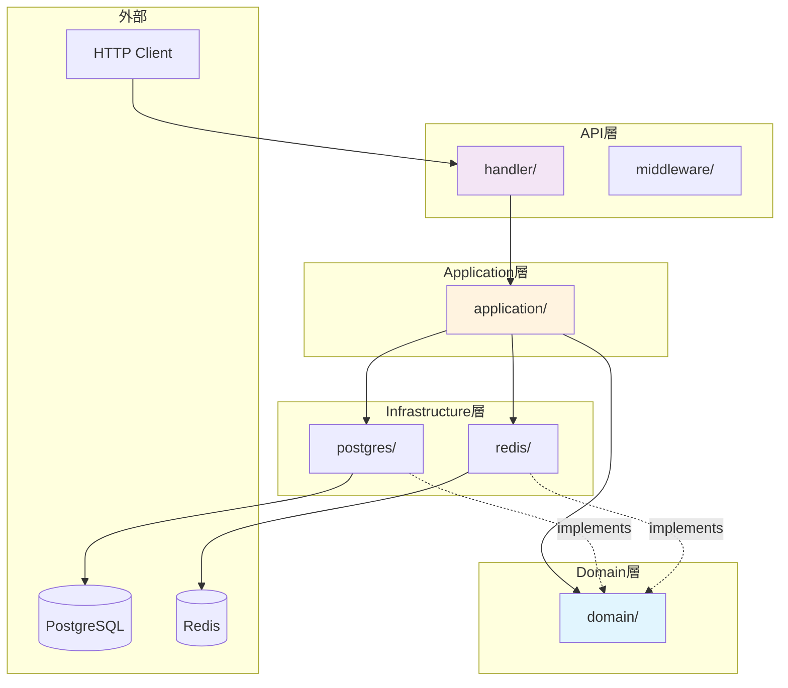
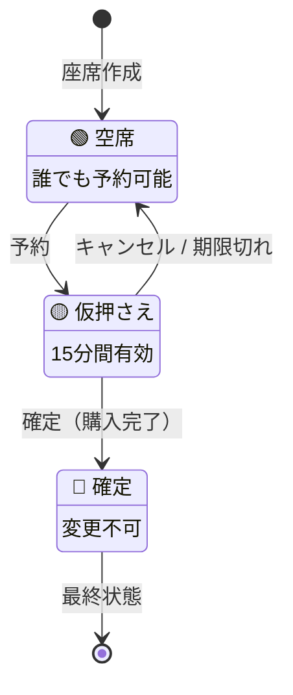
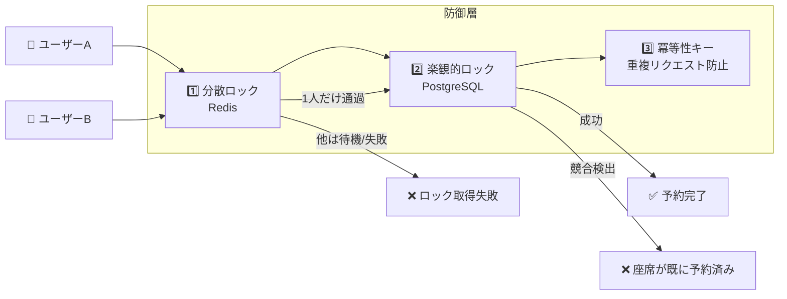
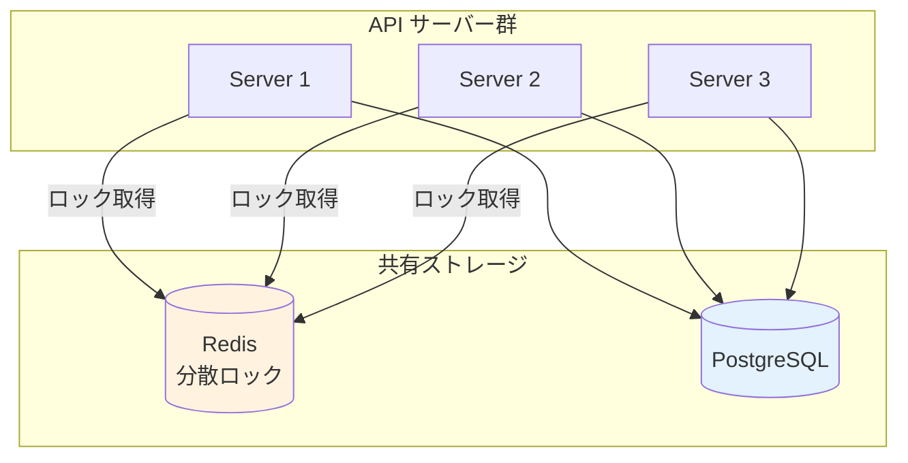
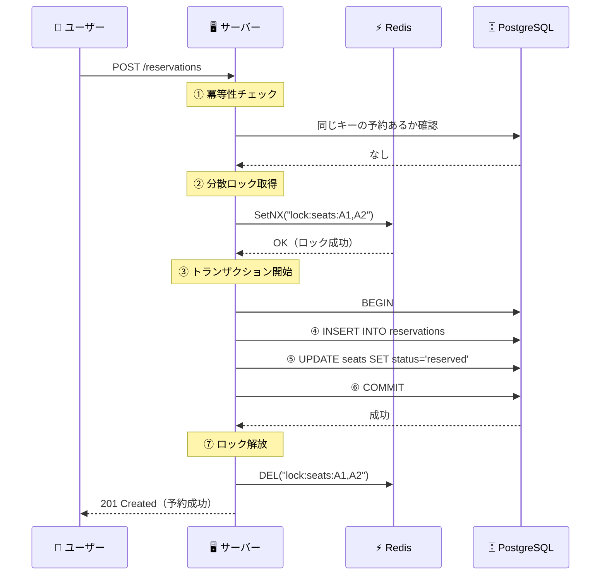
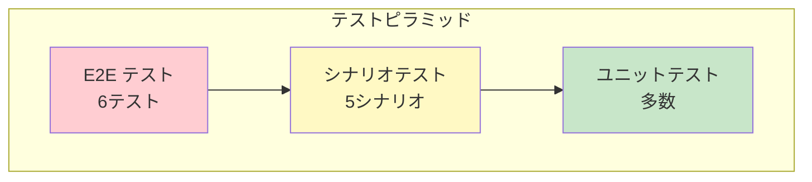
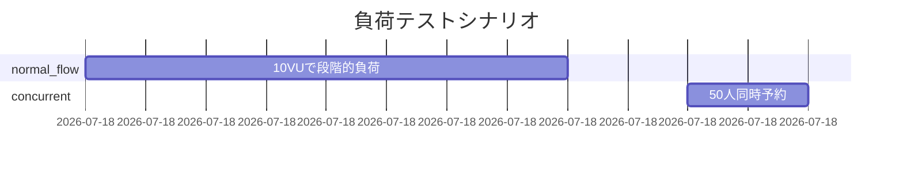
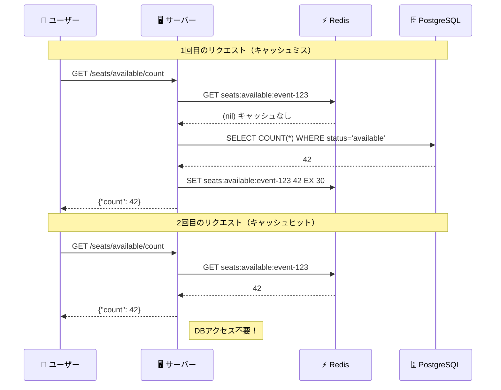
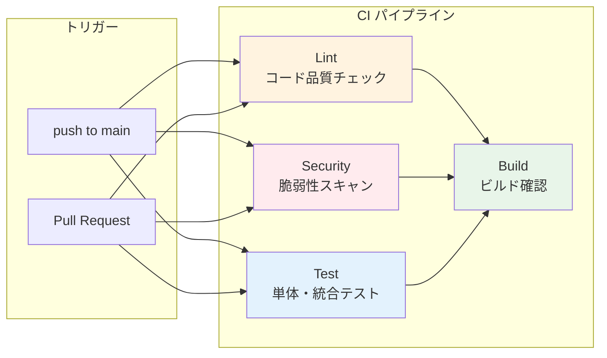
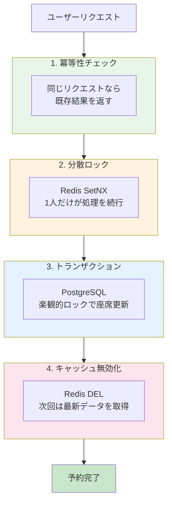

# イベントチケット予約システム - 技術解説

このドキュメントでは、本システムの設計思想と実装のポイントを解説します。

---

## 🎯 システムの目的

**「同じ座席を2人以上に販売しない」** - これがチケット予約システムの最重要課題です。

人気コンサートの発売開始時、数千人が同時に同じ座席を狙います。このとき、1つの座席は必ず1人にだけ販売されなければなりません。本システムは、この課題を **分散ロック**、**楽観的ロック**、**冪等性保証** の3つの仕組みで解決しています。

---

## 📁 プロジェクト構成

```
go-event-ticket-reservation/
├── cmd/api/main.go           ← アプリケーション起動点
├── internal/
│   ├── domain/               ← ビジネスルール（純粋なGo、外部依存なし）
│   │   ├── event/            ← イベント（コンサート、試合など）
│   │   ├── seat/             ← 座席
│   │   └── reservation/      ← 予約
│   ├── application/          ← ユースケース（トランザクション管理）
│   ├── infrastructure/       ← 外部システム連携
│   │   ├── postgres/         ← データベース操作
│   │   └── redis/            ← 分散ロック
│   ├── api/                  ← HTTPハンドラー
│   ├── pkg/logger/           ← ログ出力
│   └── worker/               ← バックグラウンド処理
└── db/migrations/            ← データベース定義
```

**設計方針**: 依存関係は「外側から内側へ」の一方向のみ。`domain` は他のどこにも依存しません。



---

## 🎫 主要な機能

### イベント（Event）

コンサートやスポーツの試合など、チケットを販売するイベントを管理します。

```go
// internal/domain/event/entity.go より
type Event struct {
    ID          string     // "550e8400-e29b-41d4-a716-446655440000"
    Name        string     // "東京ドームコンサート 2025"
    Venue       string     // "東京ドーム"
    StartAt     time.Time  // 2025-03-15 18:00:00
    EndAt       time.Time  // 2025-03-15 21:00:00
    TotalSeats  int        // 50000
}
```

**予約受付判定**: イベント開始前のみ予約可能です。

```go
func (e *Event) IsBookingOpen() bool {
    return time.Now().Before(e.StartAt)
}
```

---

### 座席（Seat）

各座席には3つの状態があります。



| 状態 | 意味 | 次のアクション |
|------|------|---------------|
| `available` | 誰でも予約可能 | 予約 → `reserved` に変更 |
| `reserved` | 15分間の仮押さえ中 | 確定 or 15分後に自動解放 |
| `confirmed` | 購入確定 | 変更不可 |

---

### 予約（Reservation）

ユーザーの予約リクエストを管理します。

```go
// internal/domain/reservation/entity.go より
type Reservation struct {
    ID             string      // 予約ID
    EventID        string      // どのイベントか
    UserID         string      // 誰の予約か
    SeatIDs        []string    // どの座席か（複数可）
    Status         Status      // pending / confirmed / cancelled
    IdempotencyKey string      // 二重予約防止キー
    TotalAmount    int         // 合計金額（円）
    ExpiresAt      time.Time   // 仮押さえ期限（15分後）
}
```

---

## 🔒 二重予約を防ぐ3つの仕組み



### 1. 分散ロック（Redis）

**問題**: 複数のサーバーで動作するシステムで、2人が「ほぼ同時に」同じ座席を予約しようとしたら？

**解決**: Redis を使った分散ロックにより、**サーバーが複数台あっても**最初の1人だけがロックを取得できます。



**なぜ Redis が必要か**: 各サーバーのメモリ内ロック（`sync.Mutex`）では、他のサーバーのリクエストを制御できません。Redis を共有することで、全サーバー間で排他制御が可能になります。

```go
// internal/infrastructure/redis/distributed_lock.go より

// SetNX = "Set if Not eXists"（存在しなければセット）
ok, _ := client.SetNX(ctx, "lock:seat-A1", "user-123", 10*time.Second)

if ok {
    // ロック取得成功 → 処理続行
} else {
    // 他の誰かがロック中 → 待機またはエラー
}
```

**ロック解放の安全性**: Lua スクリプトで「自分が取得したロックのみ」を解放します。

```lua
-- 「自分のロック」かどうか確認してから削除
if redis.call("GET", "lock:seat-A1") == "user-123" then
    return redis.call("DEL", "lock:seat-A1")
end
```

---

### 2. 楽観的ロック（PostgreSQL）

**問題**: ロックをすり抜けた場合は？

**解決**: データベース更新時に「誰も変更していないこと」を確認します。

```sql
-- 座席を予約状態に更新（available な座席のみ）
UPDATE seats
SET status = 'reserved', reserved_by = '予約ID'
WHERE id IN ('seat-A1', 'seat-A2')
  AND status = 'available';  -- ← この条件が重要

-- 更新件数が期待と異なれば、誰かが先に予約した
```

```go
// internal/infrastructure/postgres/seat_repository.go より
rows, _ := result.RowsAffected()
if int(rows) != len(seatIDs) {
    return seat.ErrSeatAlreadyReserved  // 競合発生
}
```

---

### 3. 冪等性キー（Idempotency Key）

**問題**: ネットワーク障害で同じリクエストが2回届いたら？

**解決**: 同じ `idempotency_key` のリクエストは1回しか処理しません。

```go
// internal/application/reservation_service.go より

// 1. 同じキーの予約が既にあるか確認
existing, err := s.reservationRepo.GetByIdempotencyKey(ctx, input.IdempotencyKey)
if err == nil {
    return existing, nil  // 既存の予約をそのまま返す（新規作成しない）
}

// 2. なければ新規作成
```

**使用例**（クライアント側）:
```bash
curl -X POST /api/v1/reservations \
  -d '{"idempotency_key": "order-2025-001", ...}'

# 2回送信しても予約は1件だけ
```

---

## 🔄 予約フローの全体像



---

## 📊 ログ出力

すべての処理は JSON 形式でログに記録されます。

**開発環境（読みやすい形式）**:
```
2025-12-06T15:07:40.928+0900  DEBUG  分散ロック取得中
    {"event_id": "abc123", "user_id": "user-A", "lock_key": "seats:seat-1,seat-2"}

2025-12-06T15:07:40.952+0900  INFO   予約作成成功
    {"reservation_id": "xyz789", "total_amount": 10000}
```

**本番環境（JSON形式、監視ツール連携用）**:
```json
{"level":"info","timestamp":"2025-12-06T15:07:40.952Z","msg":"予約作成成功",
 "reservation_id":"xyz789","total_amount":10000,"latency":"24ms"}
```

---

## ⏰ バックグラウンド処理

### 期限切れ予約の自動キャンセル

仮押さえ（`pending`）のまま15分経過した予約を自動でキャンセルし、座席を解放します。

```go
// internal/worker/expired_reservation_cleaner.go より

// 1分ごとにチェック
cleaner := worker.NewExpiredReservationCleaner(
    reservationService,
    1*time.Minute,   // チェック間隔
    15*time.Minute,  // 期限
)
go cleaner.Start(ctx)
```

**動作イメージ**:
```
14:00:00  ユーザーAが座席を予約（pending）
14:15:00  期限切れ
14:16:00  クリーナーが検出 → 自動キャンセル → 座席が available に戻る
```

---

## 🚀 サーバー起動の流れ

```go
// cmd/api/main.go より（簡略化）

func main() {
    // 1. 設定読み込み
    cfg := config.Load()
    
    // 2. データベース接続
    db, _ := postgres.NewConnection(&cfg.Database)
    
    // 3. Redis接続（分散ロック用）
    redisClient, _ := redis.NewClient(&cfg.Redis)
    lockManager := redis.NewLockManager(redisClient)
    
    // 4. サービス層の組み立て
    reservationService := application.NewReservationService(
        db, reservationRepo, seatRepo, eventRepo, lockManager,
    )
    
    // 5. バックグラウンドワーカー起動
    cleaner := worker.NewExpiredReservationCleaner(reservationService, ...)
    go cleaner.Start(ctx)
    
    // 6. HTTPサーバー起動
    e.Start(":8080")
    
    // 7. 終了シグナル受信時
    //    → ワーカー停止 → サーバー停止（処理中リクエスト完了を待機）
}
```

---

## 📡 API 一覧

### イベント

| 操作 | メソッド | パス | 例 |
|------|----------|------|-----|
| 作成 | POST | `/api/v1/events` | イベント新規登録 |
| 一覧 | GET | `/api/v1/events` | 全イベント取得 |
| 詳細 | GET | `/api/v1/events/:id` | 特定イベント取得 |
| 更新 | PUT | `/api/v1/events/:id` | イベント情報変更 |
| 削除 | DELETE | `/api/v1/events/:id` | イベント削除 |

### 座席

| 操作 | メソッド | パス | 例 |
|------|----------|------|-----|
| 一覧 | GET | `/api/v1/events/:event_id/seats` | 全座席と状態 |
| 作成 | POST | `/api/v1/events/:event_id/seats` | 座席1件追加 |
| 一括作成 | POST | `/api/v1/events/:event_id/seats/bulk` | 複数座席追加 |
| 空席数 | GET | `/api/v1/events/:event_id/seats/available/count` | 残席数 |

### 予約

| 操作 | メソッド | パス | 説明 |
|------|----------|------|------|
| 作成 | POST | `/api/v1/reservations` | 座席を仮押さえ（15分間） |
| 確定 | POST | `/api/v1/reservations/:id/confirm` | 仮押さえ→購入確定 |
| キャンセル | POST | `/api/v1/reservations/:id/cancel` | 予約取消、座席解放 |
| 詳細 | GET | `/api/v1/reservations/:id` | 予約情報取得 |
| 履歴 | GET | `/api/v1/reservations` | ユーザーの予約一覧 |

---

## 🧪 テスト結果

### テストカバレッジ

本システムでは、テストピラミッドに基づいた3層のテストを実装しています。



| レイヤー | テスト数 | 目的 |
|---------|---------|------|
| **E2E** | 6 | HTTPリクエスト/レスポンスの検証 |
| **Scenario** | 5 | ビジネスフロー全体の検証 |
| **Unit** | 多数 | ドメインロジックの検証 |

### 同時予約テスト（単体テスト）

10人が同時に同じ座席を予約しようとするテスト:

```
=== RUN   TestConcurrentReservation/10並行リクエストで1席のみ予約成功
    成功: 1件
    失敗: 9件（座席が既に予約済み or ロック取得失敗）
--- PASS
```

**結果**: 分散ロックと楽観的ロックにより、確実に1人だけが予約に成功。

### シナリオテスト（統合テスト）

実際のビジネスフローをシミュレートするシナリオテスト:

| シナリオ | 内容 | 結果 |
|---------|------|------|
| 完全予約フロー | イベント作成→座席作成→予約→確定 | ✅ PASS |
| 50ユーザー競合 | 50人が同じ座席を同時予約 | ✅ PASS（1人のみ成功） |
| キャンセル再予約 | ユーザーAがキャンセル後、Bが予約成功 | ✅ PASS |
| 複数座席予約 | 3座席を一括予約 | ✅ PASS |
| 確定後不変性 | 確定済み予約のキャンセル拒否 | ✅ PASS |

```
=== RUN   TestScenario_FullReservationFlow
--- PASS: TestScenario_FullReservationFlow (0.04s)
=== RUN   TestScenario_50UserCompetition
--- PASS: TestScenario_50UserCompetition (0.09s)
    scenario_test.go:xxx: 成功: 1, 失敗: 49
=== RUN   TestScenario_CancelAndRebook
--- PASS: TestScenario_CancelAndRebook (0.02s)
```

### E2Eテスト（HTTPレベル）

実際のHTTPリクエストを送信してAPIの動作を検証:

| テスト | 内容 | 結果 |
|--------|------|------|
| HealthCheck | `/health` エンドポイント確認 | ✅ PASS |
| CompleteReservationJourney | 予約の完全なライフサイクル | ✅ PASS |
| ReservationConflict | 同一座席の競合検出 | ✅ PASS |
| CancelAndRebook | キャンセル後の再予約 | ✅ PASS |
| IdempotencyKey | 冪等性キーによる重複防止 | ✅ PASS |
| EventCRUD | イベントのCRUD操作 | ✅ PASS |

```
=== RUN   TestE2E_CompleteReservationJourney
=== RUN   TestE2E_CompleteReservationJourney/イベント作成
=== RUN   TestE2E_CompleteReservationJourney/座席一括作成
=== RUN   TestE2E_CompleteReservationJourney/予約作成
=== RUN   TestE2E_CompleteReservationJourney/予約確定
--- PASS: TestE2E_CompleteReservationJourney (0.05s)
```

---

## 🛠 使用技術

| 役割 | 技術 | 選定理由 |
|------|------|----------|
| 言語 | Go | 高速、並行処理が得意 |
| Web | Echo | 軽量、高速なHTTPフレームワーク |
| DB | PostgreSQL | トランザクション、信頼性 |
| ロック | Redis | 高速な分散ロック |
| ログ | zap | 高速な構造化ログ |
| メトリクス | Prometheus | 業界標準の監視システム |
| API仕様 | OpenAPI/Swagger | 自動生成されるAPIドキュメント |
| 負荷テスト | k6 | JavaScriptで書けるシナリオ |
| テスト | testify | 読みやすいアサーション |

---

## 📈 Prometheusメトリクス

### エンドポイント

```bash
curl http://localhost:8081/metrics
```

### 収集メトリクス

| メトリクス | 種類 | 説明 |
|-----------|------|------|
| `http_requests_total` | Counter | HTTPリクエスト総数 |
| `http_request_duration_seconds` | Histogram | レイテンシ分布 |
| `reservations_total` | Counter | 予約試行数（success/conflict/error） |
| `active_reservations` | Gauge | アクティブ予約数（pending/confirmed） |
| `distributed_lock_duration_seconds` | Histogram | ロック操作時間 |

### ラベル

```prometheus
# HTTPリクエスト（メソッド、パス、ステータス別）
http_requests_total{method="POST",path="/api/v1/reservations",status_code="201"} 42

# 予約結果（成功/競合/エラー別）
reservations_total{status="success"} 35
reservations_total{status="conflict"} 7

# アクティブ予約（状態別）
active_reservations{status="pending"} 5
active_reservations{status="confirmed"} 30
```

---

## 📖 OpenAPI/Swagger

### Swagger UIアクセス

```
http://localhost:8081/swagger/index.html
```

### 仕様書の生成

```bash
# swagコマンドでドキュメント生成
swag init -g cmd/api/main.go -o docs

# 生成されるファイル
docs/
├── docs.go       # Goコード
├── swagger.json  # OpenAPI仕様（JSON）
└── swagger.yaml  # OpenAPI仕様（YAML）
```

### ハンドラーへのアノテーション例

```go
// Create godoc
// @Summary 予約を作成
// @Description 座席を仮押さえします（15分間有効）
// @Tags reservations
// @Accept json
// @Produce json
// @Param X-User-ID header string true "ユーザーID"
// @Param request body CreateReservationRequest true "予約情報"
// @Success 201 {object} ReservationResponse
// @Failure 409 {object} map[string]string "座席が既に予約済み"
// @Router /reservations [post]
func (h *ReservationHandler) Create(c echo.Context) error {
```

---

## 🔥 負荷テスト（k6）

### 実行方法

```bash
# スモークテスト（基本動作確認）
k6 run loadtest/smoke.js

# 本番シナリオ（同時予約テスト含む）
k6 run loadtest/reservation.js
```

### テストシナリオ



| シナリオ | 内容 | 目的 |
|---------|------|------|
| `normal_flow` | 10VUで2分間の通常フロー | 基本パフォーマンス計測 |
| `concurrent_reservation` | 50人が同時に同じ座席を予約 | 分散ロックの動作確認 |

### 期待される結果

```
✅ reservation_success: 1   (1人のみ成功)
⚠️ reservation_conflict: 49  (49人は競合で失敗)
❌ reservation_error: 0      (エラーなし)
```

**これは正常な動作です。** 分散ロックにより、二重予約を確実に防止しています。

### スモークテスト結果例

```
█ THRESHOLDS 
  http_req_duration ✓ 'p(95)<1000' p(95)=3.97ms
  http_req_failed   ✓ 'rate<0.01' rate=0.00%

█ TOTAL RESULTS 
  checks_succeeded: 100.00% 30 out of 30
  http_req_duration: avg=2.39ms p(95)=3.97ms
```

### 本番シナリオ実行結果

50人が同時に同じ座席を予約する競合テストを実施しました。

```
█ THRESHOLDS 
  http_req_duration ✓ 'p(95)<500' p(95)=10.77ms
  http_req_failed   ✓ 'rate<0.1' rate=1.34%
  reservation_success ✓ 'count>0' count=1

█ TOTAL RESULTS 
  checks_succeeded: 100.00% 3611 out of 3611
  http_reqs: 3712 (24.6 req/sec)
```

| 結果 | 件数 | 意味 |
|------|------|------|
| 予約成功 | 1 | 1人だけが座席を確保（正常） |
| 競合失敗 | 49 | 49人は競合エラー（正常） |
| 二重予約 | 0 | 二重予約は発生しない |

**結論**: 分散ロックと楽観的ロックにより、高負荷時も二重予約を完全に防止できています。

---

## ⚡ キャッシュ戦略

### なぜキャッシュが必要か

「残り〇席」の表示は頻繁にアクセスされます。毎回データベースに問い合わせると負荷が集中するため、Redis にキャッシュして高速化します。



### キャッシュの実装

```go
// internal/infrastructure/redis/seat_cache.go より

// キャッシュキー: "seats:available:{イベントID}"
func (c *SeatCache) availableCountKey(eventID string) string {
    return fmt.Sprintf("seats:available:%s", eventID)
}

// 空席数を取得（キャッシュから）
func (c *SeatCache) GetAvailableCount(ctx context.Context, eventID string) (int, error) {
    val, err := c.client.Get(ctx, key).Int()
    if errors.Is(err, redis.Nil) {
        return 0, ErrCacheMiss  // キャッシュにない
    }
    return val, nil
}
```

### キャッシュの利用パターン

```go
// internal/application/seat_service.go より

func (s *SeatService) CountAvailableSeats(ctx context.Context, eventID string) (int, error) {
    // 1. キャッシュから取得を試みる
    if s.cache != nil {
        count, err := s.cache.GetAvailableCount(ctx, eventID)
        if err == nil {
            return count, nil  // キャッシュヒット！
        }
    }

    // 2. キャッシュミス → DBから取得
    count, err := s.seatRepo.CountAvailableByEventID(ctx, eventID)
    
    // 3. キャッシュに保存（30秒間有効）
    if s.cache != nil {
        s.cache.SetAvailableCount(ctx, eventID, count, 30*time.Second)
    }

    return count, nil
}
```

### キャッシュの無効化

座席の状態が変わったら、キャッシュを削除して最新データを反映します。

```go
// internal/application/reservation_service.go より

// 予約成功後、キャッシュを無効化
func (s *ReservationService) CreateReservation(...) {
    // ... 予約処理 ...
    
    // キャッシュを削除（次回アクセス時にDBから再取得される）
    s.invalidateSeatCache(ctx, input.EventID)
}
```

| イベント | キャッシュ操作 |
|---------|--------------|
| 座席数を取得 | キャッシュから読む（なければDBから取得して保存） |
| 予約を作成 | キャッシュを削除 |
| 予約をキャンセル | キャッシュを削除 |

### TTL（有効期限）の考え方

| 値 | メリット | デメリット |
|----|---------|-----------|
| 短い（10秒） | データが常に最新 | キャッシュ効果が薄い |
| 長い（5分） | DBアクセス削減 | 古いデータが表示される |
| **30秒（採用）** | バランスが良い | - |

**30秒を選んだ理由**: チケット予約では「残り5席」が「残り3席」に変わっても許容範囲。ただし、売り切れ後すぐに反映されないと問題なので、長すぎる TTL は避けました。

---

## 🔄 CI/CD パイプライン

### GitHub Actions ワークフロー

コードを push すると自動で品質チェックが実行されます。



### ワークフロー設定

```yaml
# .github/workflows/ci.yml

name: CI

on:
  push:
    branches: [main]
  pull_request:
    branches: [main]

jobs:
  lint:
    # golangci-lint でコード品質をチェック
    steps:
      - uses: golangci/golangci-lint-action@v4
        with:
          args: --timeout=5m

  security:
    # govulncheck で依存パッケージの脆弱性をチェック
    steps:
      - run: |
          go install golang.org/x/vuln/cmd/govulncheck@latest
          govulncheck ./...

  test:
    # PostgreSQL と Redis をサービスコンテナとして起動
    services:
      postgres:
        image: postgres:16-alpine
      redis:
        image: redis:7-alpine
    steps:
      - run: go test -v -race -coverprofile=coverage.out ./...

  build:
    # lint, security, test が成功した場合のみ実行
    needs: [lint, security, test]
    steps:
      - run: go build -v ./cmd/api
```

### チェック内容

| ジョブ | 内容 | 失敗時 |
|-------|------|--------|
| **Lint** | コードスタイル、潜在的バグ検出 | PR をマージ不可 |
| **Security** | 依存パッケージの脆弱性チェック | PR をマージ不可 |
| **Test** | 全テスト実行（DB/Redis 使用） | PR をマージ不可 |
| **Build** | バイナリがビルドできるか確認 | PR をマージ不可 |

### golangci-lint の設定

```yaml
# .golangci.yml

linters:
  enable:
    - errcheck      # エラーハンドリング漏れ
    - govet         # 一般的なバグパターン
    - staticcheck   # 静的解析
    - goimports     # import の整理
    - misspell      # スペルミス
```

### ローカルでの実行

```bash
# lint を手元で実行
golangci-lint run

# テストを実行
go test ./... -v -race
```

---

## 📦 まとめ

本システムは以下の技術で**二重予約を防ぎながら高速なレスポンス**を実現しています。

| 課題 | 解決策 |
|------|--------|
| 同時アクセスで二重予約 | Redis 分散ロック + PostgreSQL 楽観的ロック |
| ネットワーク障害で重複リクエスト | 冪等性キーで同じ処理を1回だけ実行 |
| DB への負荷集中 | Redis キャッシュで空席数を高速取得 |
| コード品質の維持 | GitHub Actions で自動テスト・lint |
| 仮押さえの放置 | バックグラウンドワーカーで15分後に自動解放 |


